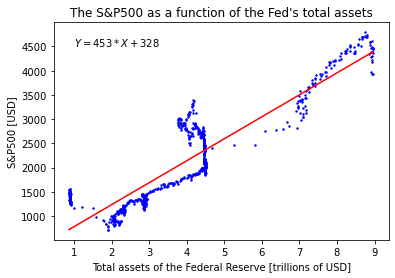

# The Federal Reserve vs. the S&P500

A linear regression comparing the balance sheet of the Federal Reserve to the closing prices of the S&amp;P500 between 2007 and 2022.

We note that this regression predicts a change of 453 points in the S&amp;P500 when the Federal Reserve increases or decreases its balance sheet by 1 trillion USD.

The regression also predicts that the S&amp;P500 would be priced at 327 points if the Federal Reserve were to remove all liquidity.

We also note that the proposed relation might be a correlation rather than a causation, since both the balance sheet of the Federal Reserve and the price of the S&amp;P500 have tended to increase over time during the studied time period.

It would be interesting to continue the study with future data, now that the Fed has started to decrease its balance sheet.
